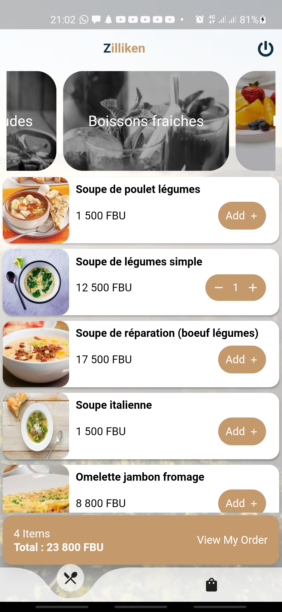
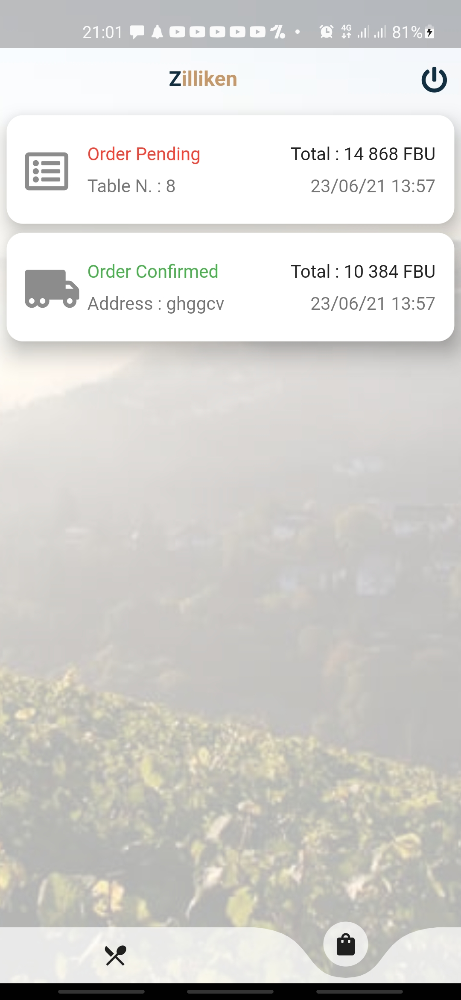
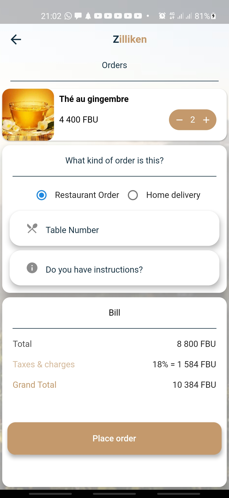
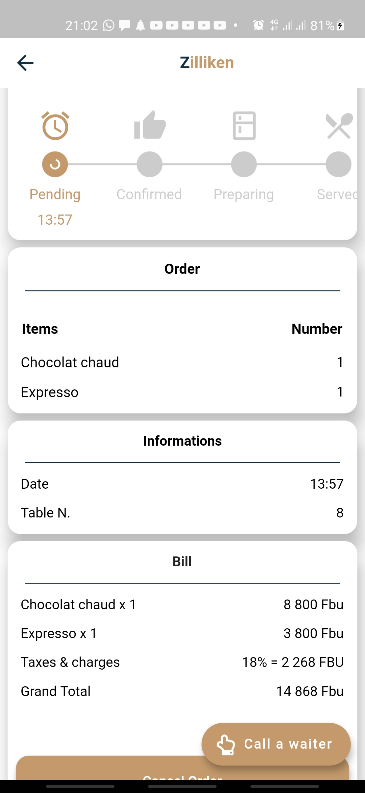
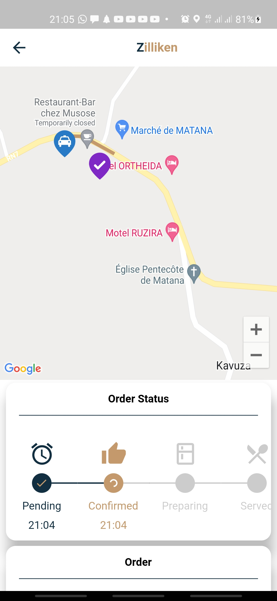
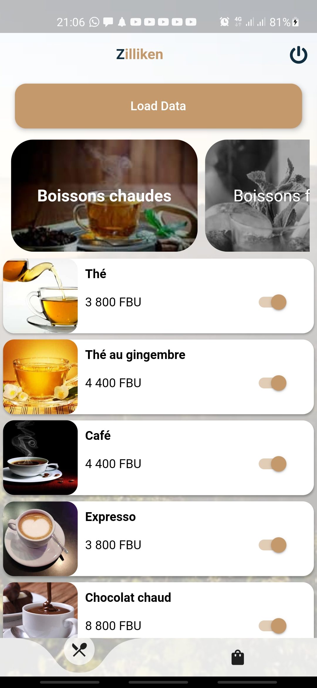

# zilliken

Zilliken - Restaurant Ordering and Delivering App.

[The app can be downloaded here](https://play.google.com/store/apps/details?id=net.visionplusplus.zilliken).

# Summary

Zilliken is a food ordering and delivering app made with flutter and firebase. This app was made to replace physical menus that are used in local restaurants. The customer is presented instead with a tablet with a digital menu where he can make his order.

The restaurant staff receives the order instantly as soon as the customer confirms the order. This has the advantage of eliminating errors and making it easy to keep track of how the restaurant is doing.

The app is also equipped with an admin area that allows the restaurant staff to manage the orders and update the menu. The app also displays stats regarding the orders that came in each day.

<table>
  <tr>
    <td></td>
    <td></td>
    <td></td>
  </tr>
  <tr>
    <td></td>
    <td></td>
    <td></td>
  </tr>
 </table>

# How to Run it

The easiest way to run it is to download the demo app on the play store [here](https://play.google.com/store/apps/details?id=net.visionplusplus.zilliken).
If you prefer to build it yourself, there are a few things you have to do:

- First, create a firebase project and follow the instructions to link the project to flutter
- Generate two API keys for android and iOS and make sure they can access the maps SDK for each respective platform, Firebase Installations API, Places API, Directions API, Geocoding API, and Geolocalisation API.
- In the AndroidManifest.xml, find the com.google.android.geo.API_KEY meta-data and change the value with your android API key.
- In AppDelegate.swift, find the line GMSServices.provideAPIKey(“”) and place your iOS API key inside the bracket.
- In the lib folder, navigate to Helpers/Utils.dart and modify the getMapsKey to include both your Android and iOS API key.
- Finally, the project is ready to be built.
